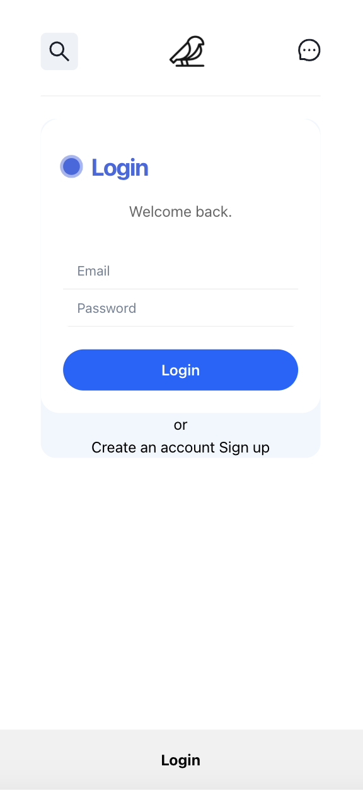
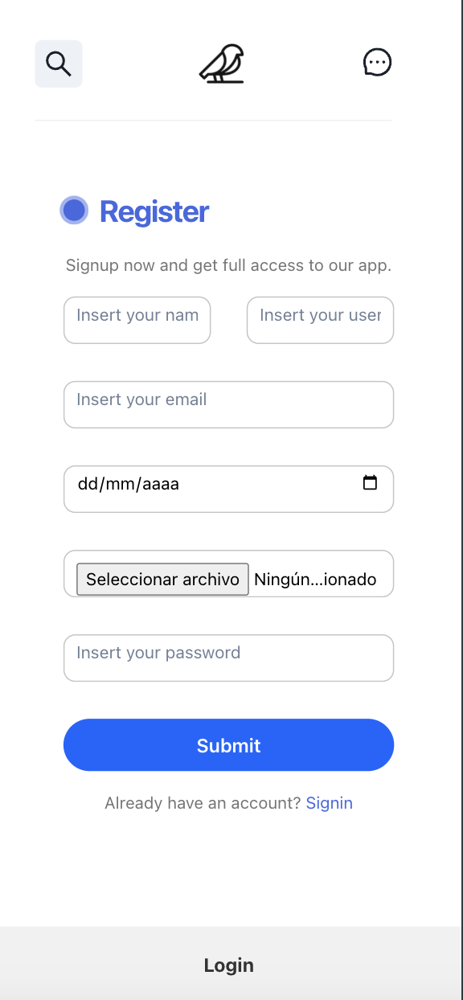
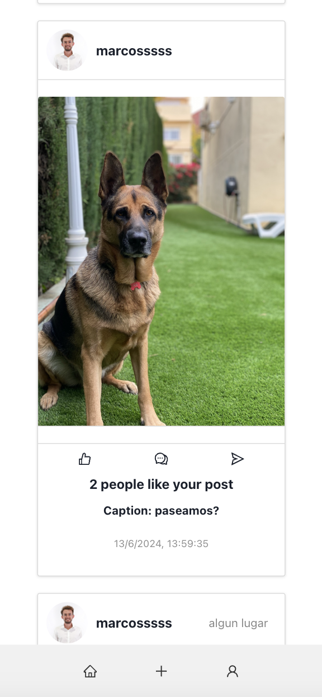
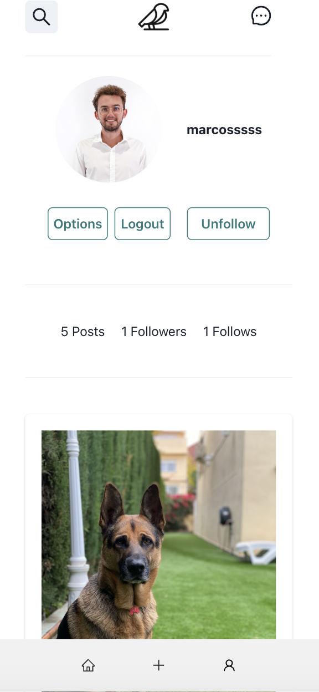
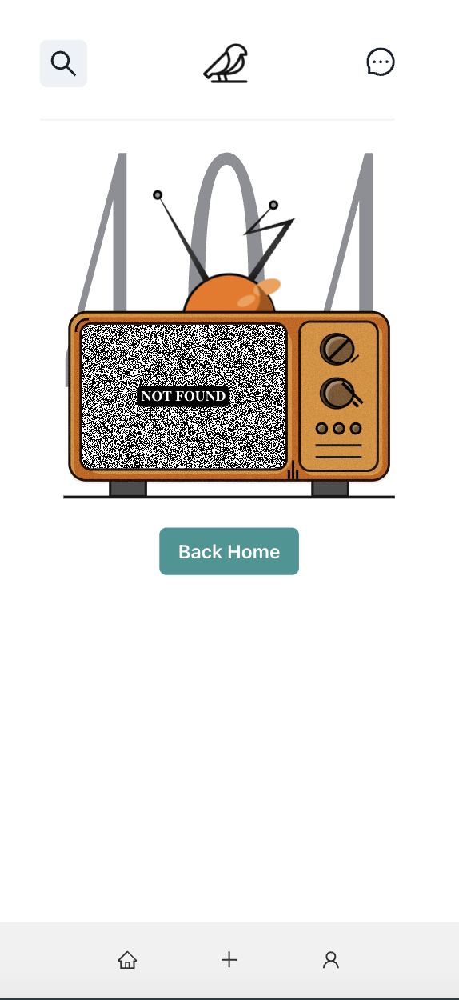

# Red Social TukTuk 📲

En este proyecto hemos querido desarrollar una red social con React y Redux, que permite a los usuarios registrarse, iniciar sesión, crear publicaciones, comentar, dar likes, y más. Se utiliza React Router para la navegación, y el proyecto incluye múltiples componentes que gestionan distintas funcionalidades de la red social.

## Descripción

La aplicación permite a los usuarios interactuar entre sí mediante publicaciones, comentarios y likes. Cada usuario tiene un perfil donde puede ver sus datos y sus publicaciones.

## Características

- **Registro de usuarios**
- **Inicio de sesión de usuarios**
- **Creación y eliminación de publicaciones**
- **Like y quitar like en publicaciones**
- **Visualización de perfil con datos y publicaciones del usuario**
- **Comentarios en publicaciones**
- **Seguimiento de usuarios y visualización de seguidores y seguidos**
- **Implementación de guards para rutas privadas**

## Componentes

- `Header`: Encabezado de la aplicación.
- `Footer`: Pie de página de la aplicación.
- `Welcome`: Página de bienvenida.
- `Home`: Página principal.
- `Register`: Formulario de registro de usuarios.
- `Login`: Formulario de inicio de sesión.
- `Profile`: Vista del perfil del usuario logueado.
- `ProfileDetails`: Detalles del perfil del usuario.
- `CreatePost`: Creación de nuevas publicaciones.
- `Post`: Listado de todas las publicaciones.
- `PostDetails`: Detalles de una publicación específica.
- `Chat`: Chat entre usuarios.
- `UserConfirmed`: Confirmación de usuario.
- `NotFound`: Página de error 404.

## Instalación y Ejecución

1. Clona el repositorio:
   ```bash
   git clone <URL-del-repositorio>
   ```

2. Navega al directorio del proyecto:
    ```bash
    cd <nombre-del-proyecto>
    ```

3. Instala las dependencias:
    ```bash
    npm install
    ```

4. Inicia la aplicación:
    ```bash
    npm start
    ```

La aplicación estará disponible en http://localhost:3000.

## Navegación de Rutas

- `/`: Página de bienvenida.
- `/home`: Página principal.
- `/register`: Registro de usuarios.
- `/login`: Inicio de sesión.
- `/profile`: Perfil del usuario (requiere autenticación).
- `/createPost`: Crear una nueva publicación.
- `/allposts`: Listado de todas las publicaciones.
- `/confirm`: Confirmación de usuario.
- `/postDetails/:_id`: Detalles de una publicación específica.
- `/profileDetails`: Detalles del perfil del usuario.
- `*`: Página de error 404.

## Implementación de Guards

El componente `PrivateZone` se utiliza para proteger rutas que requieren autenticación. Si el usuario no está autenticado, se redirige a la página de inicio de sesión.

## Despliegue

La aplicación esta desplegada en Vercel y esta es la url: https://frontend-tuktuk.vercel.app/


## Imágenes

    

## Contribuciones

Las contribuciones son bienvenidas. Para contribuir, por favor realiza un fork del repositorio, crea una nueva rama, realiza tus cambios y envía un pull request.

## Contacto

Para cualquier duda o consulta, por favor contacta con: [Manuel Dana](https://github.com/manudana11) y [Jairo Nuñez](https://github.com/jaironf)


¡Gracias por utilizar nuestra red social!
